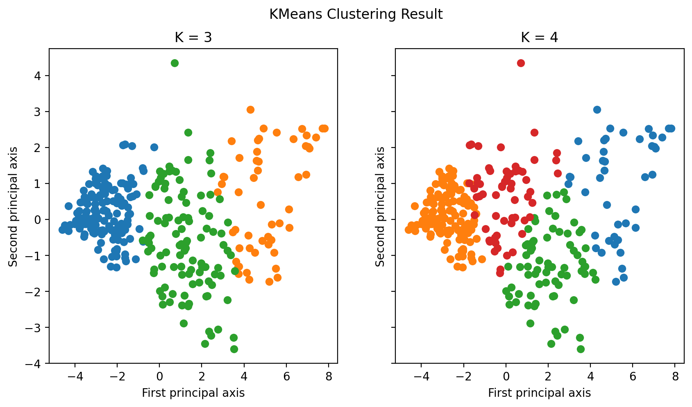

# Portfolio

---

## 數據分析與資料科學專案

### [風向哪裡跑？](/Projects/US%20Election%202016.html)

**美國 2016 總統大選時期 Facebook 粉絲專頁與用戶行為的社會網路探討**

*Facebook 上川普大戰希拉蕊時的美國鄉民互動可以看出什麼端倪？此份研究將用戶與粉專的互動間構成一個二分社會網路 (bipartite social network)，並以此網路計算各個粉專的特徵中心性 (eigenvector centrality)。觀察粉專中心性的變化可以看到 9/26 有一個極大的轉變...這個轉變背後究竟是什麼事件？*

---
### [ParkFinder](https://parkfinder.streamlit.app/)

**自動化蒐集台北市停車場資料，並建立網站提供視覺化應用**

*台北市的月租停車場並沒有保證有車位停，所以到底該租哪裡成為了脫離學校停車場後最頭痛的問題。為了瞭解附近停車場個時段空位，我與另一位作者開始定期搜集停車場空位資料，並寫成互動式網頁供後人參考。*

### [延伸分析 --- 可否根據停車場空位性質，區分種類？](/Projects/classify_park.html)

**由自行搜集之資料，進行非監督式機器學習中的分群**

*好不容易蒐集到了的停車場長時間車位變化，我們可以從這些變化中學到什麼？很重要的第一步就是幫停車場根據個時段空位性質進行分群。我透過主成分分析 (Principal component analysis) 進行降為後，嘗試了 DBSCAN 以及 KMeans。如果分群結果符合直覺，則在地圖上就可以更快速找到符合自己停車時段習慣的車位，非常方便！*

    
---

## Medium 文章選集

### [機器學習 vs 經濟學](https://medium.com/@ted21019/機器學習-vs-經濟學-3ec7068556cc)

*在因果推論為主的計量經濟學中，可以如何使用以預測為主的機器學習？*

---
### [經濟學家的海底撈針 — 央行阻升不阻貶的計量證明](https://ted21019.medium.com/經濟學家的海底撈針-央行阻升不阻貶的計量證明-e16eda02942d)

*央行究竟有沒有阻升不阻貶？這篇介紹了如何利用 SVAR 撈出匯率衝擊，藉此驗證一個看似羅生門的議題...*

---
### [FTX 背後的經濟學，以及為什麼身為經濟系不敢玩加密貨幣](https://medium.com/@ted21019/ftx-背後的經濟學-以及為什麼身為經濟系不敢玩加密貨幣-7bbed86d496f)

*FTX 事件背後真的如媒體所說的，是加密貨幣的龐是騙局嗎？還是其實跟一般的金融體系崩盤一樣呢？*

---
### [兩年經濟學研究所的教育給我的啟發](https://medium.com/@ted21019/兩年經濟學研究所的教育給我的啟發-441cf10f277a)

*既不是股票，也不是總體預測。經濟學教育真正帶來的啟發終究還是回到人身上...*

---
### [Simulation Based Estimation — How You Estimate as if You were Playing Monopoly](https://medium.com/@ted21019/simulation-based-estimation-how-you-estimate-as-if-you-were-playing-monopoly-bcfc6f3aba65)

*以個體選擇出發的模擬估計方法，如何幫助經濟學家研究飛機航線的市場？*

---
### [How Genetic Algorithm Might Be Useful in Economics Study](https://medium.com/@ted21019/how-genetic-algorithm-might-be-useful-in-economics-study-25f761a3446a)

*理性預期如果無法完美的刻劃人的行為，那這個方法就可以模擬人的學習過程。究竟在模擬學習過程後，有沒有辦法解決經濟學中實證與理論不符的諸多現象？*

---

Page template forked from <a href="https://github.com/evanca/quick-portfolio">evanca</a>

<!-- Remove above link if you don't want to attibute -->
