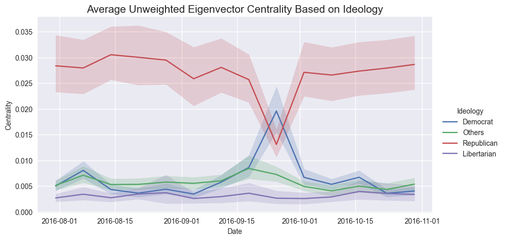
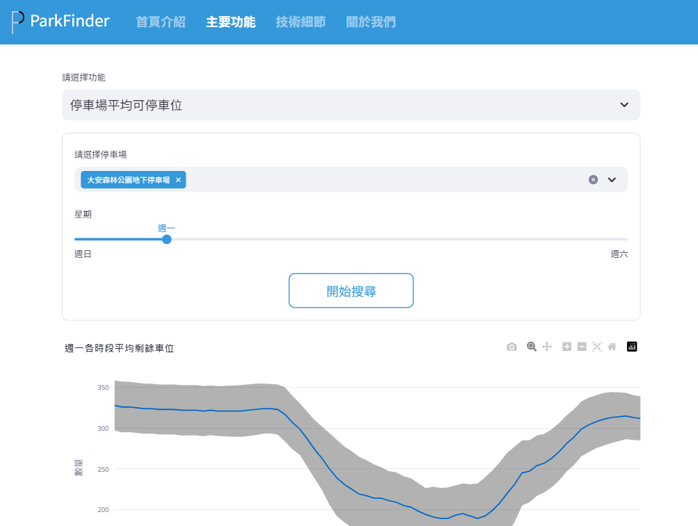

## Portfolio

---

### EDA

#### [**風向哪裡跑？**](/Projects/US%20Election%202016.html)

*美國 2016 總統大選時期 Facebook 粉絲專頁與用戶行為的社會網路探討*

---
#### [**ParkFinder**](https://parkfinder.streamlit.app/)

*自動化蒐集台北市停車場資料，並建立網站提供視覺化應用*

---

### Medium 選集

#### [機器學習 vs 經濟學](https://medium.com/@ted21019/機器學習-vs-經濟學-3ec7068556cc)

*在因果推論為主的計量經濟學中，可以如何使用以預測為主的機器學習？*

---
#### [FTX 背後的經濟學，以及為什麼身為經濟系不敢玩加密貨幣](https://medium.com/@ted21019/ftx-背後的經濟學-以及為什麼身為經濟系不敢玩加密貨幣-7bbed86d496f)

*FTX 事件背後真的如媒體所說的，是加密貨幣的龐是騙局嗎？還是其實跟一般的金融體系崩盤一樣呢？*

---
#### [兩年經濟學研究所的教育給我的啟發](https://medium.com/@ted21019/兩年經濟學研究所的教育給我的啟發-441cf10f277a)

*既不是股票，也不是總體預測。經濟學教育真正帶來的啟發終究還是回到人身上...*

---
#### [Simulation Based Estimation — How You Estimate as if You were Playing Monopoly](https://medium.com/@ted21019/simulation-based-estimation-how-you-estimate-as-if-you-were-playing-monopoly-bcfc6f3aba65)

*以個體選擇出發的模擬估計方法，如何幫助經濟學家研究飛機航線的市場？*

---
#### [How Genetic Algorithm Might Be Useful in Economics Study](https://medium.com/@ted21019/how-genetic-algorithm-might-be-useful-in-economics-study-25f761a3446a)

*理性預期如果無法完美的刻劃人的行為，那這個方法就可以模擬人的學習過程。究竟在模擬學習過程後，有沒有辦法解決經濟學中實證與理論不符的諸多現象？*

---

Page template forked from <a href="https://github.com/evanca/quick-portfolio">evanca</a>

<!-- Remove above link if you don't want to attibute -->
